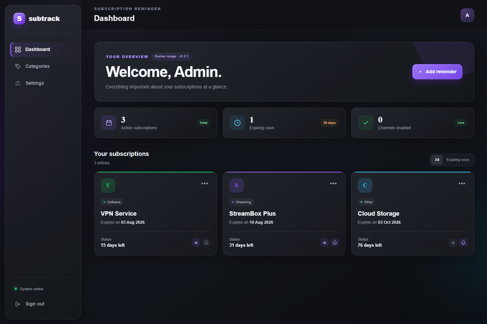
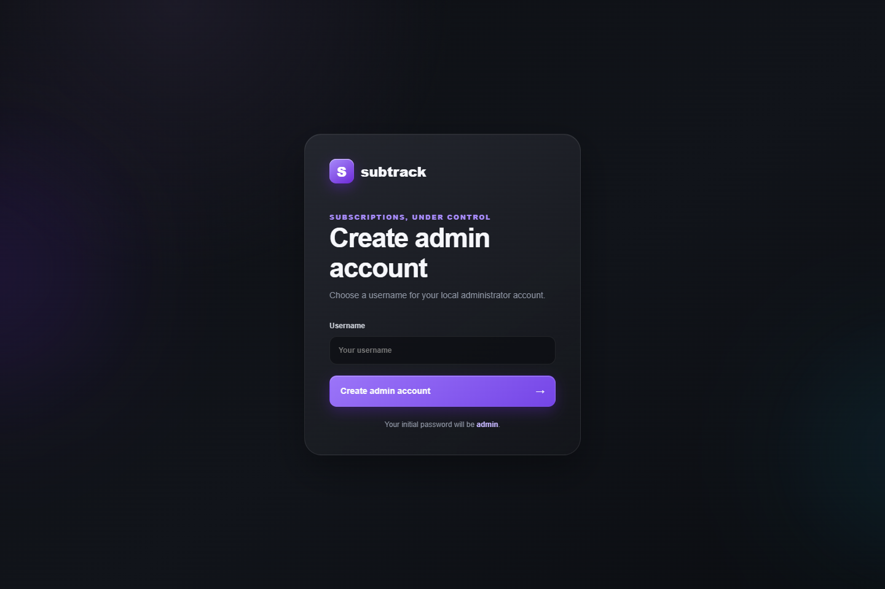
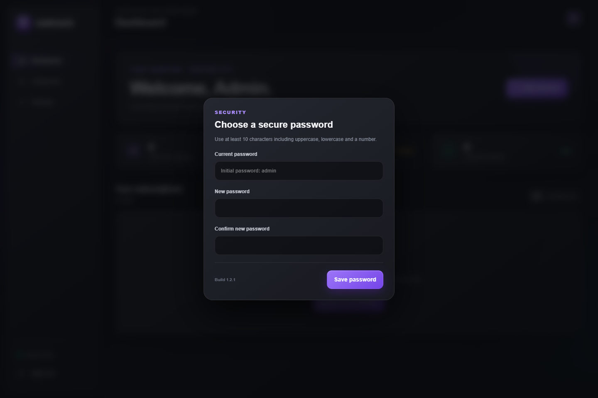
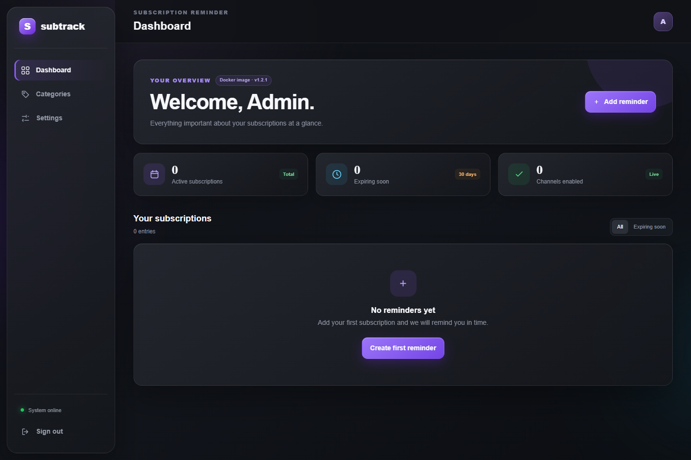
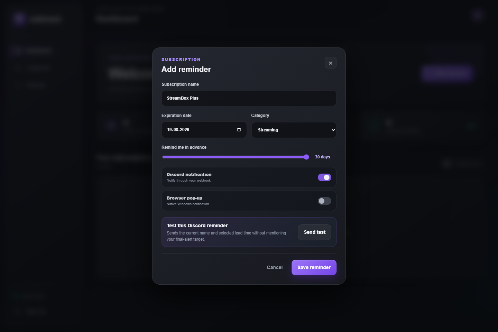
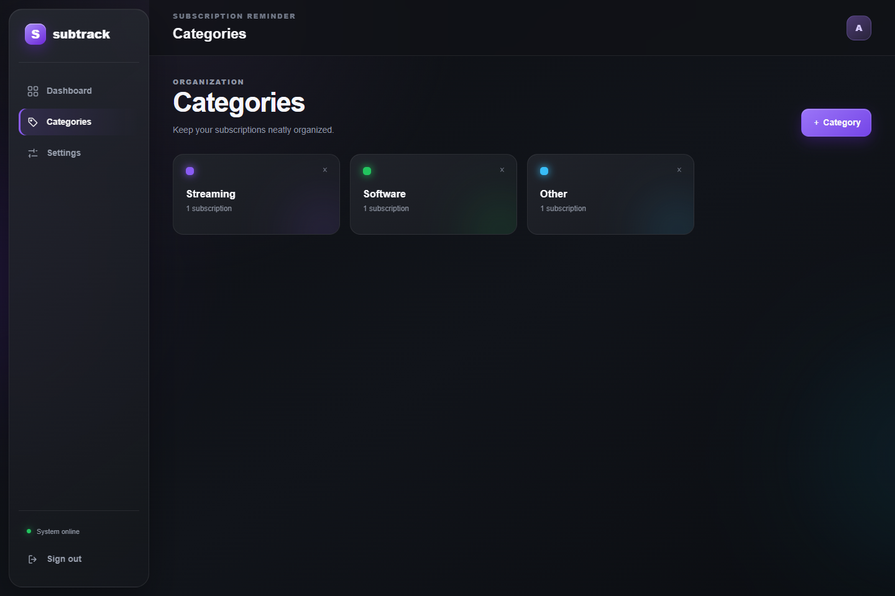
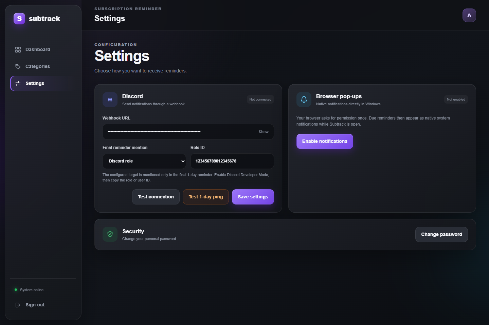

# Subtrack — Subscription Reminder

[](https://github.com/Maomao63/Subscription-Reminder/pkgs/container/subscription-reminder)
[](https://github.com/Maomao63/Subscription-Reminder/actions)
[](https://github.com/Maomao63/Subscription-Reminder/pkgs/container/subscription-reminder)

Subtrack is a lightweight, self-hosted subscription reminder with a modern dark web interface. It keeps subscription dates, categories, notification preferences, and credentials in one persistent local configuration file. No external database is required.



> All screenshots use synthetic example data. They contain no personal account information, real webhook URLs, or real Discord IDs.

## Features

- Modern responsive graphite dashboard
- Local administrator account with a mandatory password change after first sign-in
- Custom categories with individual accent colors
- Configurable expiration dates, exact times, IANA timezones, and reminder lead times
- Independent Discord and browser notification switches for every subscription
- Discord webhook connection test
- Per-reminder Discord preview without pinging the emergency target
- Two-stage Discord notifications:
  - An initial reminder at the selected lead time, for example `30 days left`
  - A final emergency reminder `1 day left` with an optional role or user ping
- Final ping targets: Discord role, Discord user, `@everyone`, `@here`, or no mention
- Dedicated **Test 1-day ping** button
- Persistent JSON configuration suitable for Unraid and other Linux servers
- Multi-architecture Docker images for `amd64` and `arm64`
- Built-in container health check

## Notification behavior

| Stage | Example | Mention behavior |
|---|---|---|
| Reminder preview | `StreamBox Plus — 30 days left` | Never mentions the final target |
| Initial scheduled reminder | `StreamBox Plus — 30 days left` | No role or user ping |
| Final scheduled reminder | `StreamBox Plus — 1 day left` | Mentions the configured final target |
| 1-day ping test | `Emergency ping test — 1 day left` | Uses the real configured final target |

The server checks Discord reminders every minute, even when the web interface is closed. If a subscription is created inside the final one-day window, Subtrack sends only the final alert to avoid duplicate messages.

## Quick start with Docker Compose

Create a `docker-compose.yml` file:

```yaml
services:
  subscription-reminder:
    image: ghcr.io/maomao63/subscription-reminder:latest
    pull_policy: always
    container_name: subscription-reminder
    restart: unless-stopped
    ports:
      - "13000:13000"
    volumes:
      - "${CONFIG_PATH:-./config}:/config"
    environment:
      TZ: "${TZ:-Europe/Berlin}"
      PUID: "${PUID:-99}"
      PGID: "${PGID:-100}"
```

Start the container:

```bash
docker compose pull
docker compose up -d
```

Open:

```text
http://SERVER-IP:13000
```

To use a different host port, change only the left side of the mapping, for example `8080:13000`.

## Unraid setup

Create a `.env` file next to `docker-compose.yml`:

```env
CONFIG_PATH=/mnt/user/appdata/subscription-reminder
TZ=Europe/Berlin
PUID=99
PGID=100
```

The persistent configuration will be stored at:

```text
/mnt/user/appdata/subscription-reminder/config.json
```

The default `99:100` ownership matches the common Unraid `nobody:users` account.

## Generic Linux setup

Choose any persistent directory and set the UID and GID of the account that should own it:

```env
CONFIG_PATH=/opt/subscription-reminder
TZ=Europe/Berlin
PUID=1000
PGID=1000
```

Then prepare the directory and start Subtrack:

```bash
sudo mkdir -p /opt/subscription-reminder
sudo chown -R 1000:1000 /opt/subscription-reminder
docker compose pull
docker compose up -d
```

Without a `.env` file, Compose uses `./config` next to the Compose project.

## First start

1. Open Subtrack in a browser.
2. Choose the local administrator username.
3. Sign in with that username and the initial password `admin`.
4. Set a new password with at least ten characters, uppercase, lowercase, and a number.
5. Add categories, notification settings, and reminders.

### Create the administrator account



### Mandatory password change



### Fresh dashboard



## Creating reminders

Select **Add reminder**, then configure:

- Subscription name
- Expiration date
- Expiration time and provider timezone (for example `Europe/Berlin` or `UTC`)
- Category
- Initial reminder lead time
- Discord notification toggle
- Browser pop-up toggle

When Discord is enabled, **Send test** previews the current subscription name and lead time. This preview intentionally does not ping the final emergency target.



## Categories

Categories make subscriptions easier to scan and provide the accent colors used on dashboard cards.



## Discord setup

### 1. Create a Discord webhook

1. Open the target Discord server.
2. Open **Server Settings**.
3. Select **Integrations** → **Webhooks**.
4. Create a webhook and choose the notification channel.
5. Select **Copy Webhook URL**.
6. Paste the complete URL into **Subtrack → Settings → Discord**.
7. Save the settings and use **Test connection**.

Treat the webhook URL like a password. Anyone with the URL can post messages to its channel.

### 2. Enable Discord Developer Mode

Discord exposes role and user IDs only when Developer Mode is enabled:

1. Open **User Settings** in Discord.
2. Select **Advanced** under **App Settings**.
3. Enable **Developer Mode**.

### 3. Configure a role ping

Use this option to notify a group such as `@Admin`:

1. Open **Server Settings** → **Roles**.
2. Find the required role, for example **Admin**.
3. Right-click the role and select **Copy Role ID**.
4. In Subtrack, select **Discord role**.
5. Paste the copied number into **Role ID**.
6. Save the settings.
7. Select **Test 1-day ping**.

The stored value looks like `123456789012345678`, but Discord renders it as the actual role name, for example `@Admin`.

For a real notification, the Discord role must be mentionable. Enable **Allow anyone to @mention this role** in the role settings, or ensure the webhook has the required mention permission.

### 4. Configure a user ping

Use this option to notify one specific Discord account:

1. Right-click the user in the server member list or on one of their messages.
2. Select **Copy User ID**.
3. In Subtrack, select **Discord user**.
4. Paste the number into **User ID**.
5. Save the settings.
6. Select **Test 1-day ping**.

Discord renders the ID as the current Discord display name when the message is delivered.

### 5. Configure `@everyone` or `@here`

Select `@everyone` or `@here` from the final reminder dropdown. These options do not require an ID. The Discord channel and webhook must be permitted to use these mentions.

### Which Discord IDs are required?

| Ping target | Required value | Where to find it |
|---|---|---|
| Discord role | Role ID | Server Settings → Roles → right-click role → Copy Role ID |
| Discord user | User ID | Right-click user or their message → Copy User ID |
| `@everyone` | Nothing | Select it from the dropdown |
| `@here` | Nothing | Select it from the dropdown |
| No mention | Nothing | Select **No mention** |

Subtrack does not require a Server ID, Guild ID, or Channel ID. The webhook URL already identifies the destination channel.



## Browser notifications

Browser pop-ups work independently from Discord. Enable them under **Settings → Browser pop-ups** and grant permission when the browser asks.

Native notifications require a secure context:

- `http://localhost:13000` is accepted for local testing.
- Access through a server IP over plain HTTP is not considered secure by Firefox or Chromium.
- For remote devices, place Subtrack behind a trusted HTTPS reverse proxy.

Browser reminders are delivered while Subtrack is open in a browser tab. Discord reminders are processed by the server and do not require an open tab.

## Persistent data and permissions

Subtrack stores everything in `/config/config.json` inside the container:

- Administrator username and password hash
- Categories
- Reminders and delivery status
- Discord webhook and mention configuration

`PUID` and `PGID` control the user that runs the Node.js process and owns the mounted configuration. The entrypoint prepares the mounted directory before dropping root privileges.

If the container reports `EACCES` for `/config/config.json.tmp`, verify that:

- `CONFIG_PATH` points to a directory, not a file.
- The directory exists on the host.
- `PUID` and `PGID` match the intended host ownership.
- The volume is mounted read-write.

## Updating

```bash
docker compose pull
docker compose up -d
```

The configuration remains on the host and survives updates or container recreation. Back up the configured host directory regularly because it contains both reminder data and the Discord webhook.

## Health check

The image includes a health check against:

```text
GET /api/health
```

It returns the service state and installed Subtrack version.

## Local development

Requirements:

- Node.js 20 or newer
- No external runtime dependencies

Start the application:

```bash
npm start
```

Optional environment variables:

| Variable | Default | Purpose |
|---|---|---|
| `PORT` | `13000` | Internal HTTP port |
| `CONFIG_DIR` | `./data` outside Docker | Configuration directory |
| `CONFIG_FILE` | `<CONFIG_DIR>/config.json` | Explicit configuration file |
| `TZ` | Host/container default | Notification timezone |
| `PUID` | `99` in the image | Runtime user ID |
| `PGID` | `100` in the image | Runtime group ID |

## Security notes

- Subtrack is designed for a trusted self-hosted environment.
- Do not publish port `13000` directly to the internet without HTTPS and additional network protection.
- Keep `/config/config.json` private and include it only in protected backups.
- Rotate the Discord webhook immediately if it is exposed.
- Replace the initial `admin` password during the mandatory first-login flow.
